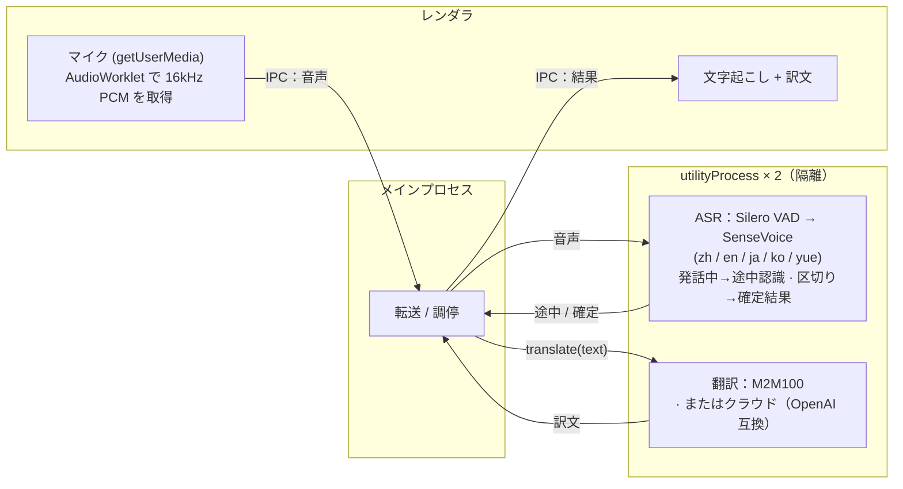

# Meeting Translator

> macOS・iOS・ブラウザ向けのローカル・リアルタイム会議文字起こし＆翻訳——音声もテキストも端末に留まります（クラウド翻訳は任意）。

[English](README.md) · [简体中文](README.zh-CN.md) · **日本語** · [한국어](README.ko.md)

ブラウザですぐに試せます：**https://baijunjie.github.io/meeting-translator/**

## 機能

- リアルタイムのマイク文字起こし：中国語 / 日本語 / 英語 / 韓国語 / 広東語（自動判定）
- ライブ字幕——話している間に途中結果を表示し、発話区切りで確定
- **母語ドリブン**——初回起動で母語を選択（簡体字 / 繁体字中国語、日本語、英語、韓国語）；UI 全体が母語で表示され、翻訳をオンにすると会議中の他言語はすべて母語に翻訳
- 翻訳エンジンを切り替え可能：
  - **ローカル**（既定）：端末上で実行——初回ダウンロード後はオフラインで動作し、テキストは端末外に出ません（macOS / Web は M2M100、iOS は Apple の Translation フレームワーク）
  - **クラウド**（任意）：OpenAI 互換の任意エンドポイント（設定で Base URL / API Key / モデルを入力；キーは端末にのみ保存）——有効にするとテキストは第三者に送信されます
- 会話のアーカイブ——セッションを保存して後で再表示
- 設定：母語、文字サイズ、翻訳方式
- CPU のみでリアルタイム動作（Apple Silicon 実測 RTF ≈ 0.03）、GPU 不要

## 使い方

1. **初回起動**——オンボーディング画面で言語を選択。
2. **録音開始**をクリック——話すと字幕がリアルタイムに表示。
3. **翻訳**をオンにすると各行の下に母語訳が表示。
4. **⚙ 設定**で母語・文字サイズ・翻訳方式（およびクラウド認証情報）を変更。

マイクへのアクセスを要求する前に、アプリが用途を説明します。その後 OS が許可ダイアログを表示します。

## プロジェクト構成

**pnpm ワークスペース monorepo**——共有ロジック/UI、プラットフォームごとに 1 パッケージ。3 つのプラットフォームはすべて**同じ `@mt/ui`** を描画し、違いは注入される `AppBridge` だけです：

- `packages/core`（`@mt/core`）——プラットフォーム非依存の TS：ドメイン型、設定/アーカイブ、翻訳（`Translator` + クラウド + 簡繁変換）、ASR モデル一覧、能力ブリッジ `AppBridge`。
- `packages/ui`（`@mt/ui`）——共有 Vue 3 UI；注入された `AppBridge` 経由でのみプラットフォームに触れる（`window.api` 直参照なし）。
- `apps/macos`（`@mt/macos`）——Electron アプリ；utilityProcess で ASR/翻訳・録音・fs ストレージなど `AppBridge` を実装し、`@mt/ui` をホスト。
- `apps/ios`（`@mt/ios`）——Capacitor アプリ（実動作）；ネイティブプラグインが端末上で sherpa-onnx を実行して認識（iOS xcframework）、端末上翻訳は Apple の Translation フレームワーク（iOS 18+）。`apps/ios/native-plugin/INTEGRATION.md` 参照。
- `apps/web`（`@mt/web`）——インストール可能なブラウザ **PWA**；ASR は単一スレッドの WebAssembly を Web Worker で実行（sherpa-onnx）、ローカル翻訳は Transformers.js（M2M100）を Web Worker で実行、ストレージは IndexedDB。公開先 https://baijunjie.github.io/meeting-translator/ 。
- `assets/`——共有ブランド素材（`icon.svg` / `icon.png`）。各アプリがここから自分のアイコン形式を生成。

## 開発

**pnpm** が必要。Vite + Vue 3 + Naive UI、すべて TypeScript（macOS は electron-vite を使用）。

```bash
pnpm install
pnpm dev                    # macOS アプリをホットリロードで起動（→ @mt/macos）
pnpm --filter @mt/web dev   # ブラウザ PWA の開発サーバを起動（→ @mt/web）
```

iOS は `apps/ios/native-plugin/INTEGRATION.md` を参照（ネイティブプラグインを Capacitor iOS ホストに組み込む必要があり、Xcode ツールチェーンが必須。Translation フレームワークは実機が必要）。

macOS / Web では初回起動時にアプリが ASR モデルを自動ダウンロードします（セットアップ画面）。ローカル翻訳モデルは初回使用時にダウンロードされます。

その他：`pnpm build`、`pnpm type-check`。パッケージ単位：`pnpm --filter @mt/macos <script>`（例 `clean`、`test-translate`）。

### パッケージング（macOS）

```bash
pnpm dist        # ビルド + electron-builder → apps/macos/release/*.dmg（arm64）
pnpm dist:dir    # 展開済み .app のみ（高速、デバッグ用）
```

生成物は現在**未署名**です——開くには右クリック →「開く」（または app に `xattr -dr com.apple.quarantine` を実行）。一般配布には Apple Developer ID で署名・公証してください。モデルは同梱されず、初回使用時にユーザーデータ領域へダウンロードされます。

### Web（PWA）

公開先 **https://baijunjie.github.io/meeting-translator/**——インストール可能で、初回読み込み後はオフラインで動作します（モデルとアプリシェルをキャッシュ）。

- ASR は **単一スレッドの WebAssembly** を Web Worker で実行（sherpa-onnx）——COOP/COEP ヘッダ不要なので GitHub Pages で無料ホスティングできます。
- モデルは初回使用時に CDN から取得（SenseVoice は HuggingFace；Silero VAD は GitHub Releases に CORS が無いためアプリと同一オリジンに同梱）し、Cache Storage にキャッシュ。設定/アーカイブは IndexedDB に保存。
- GitHub Actions ワークフロー（`.github/workflows/deploy-web.yml`）が `main` への push ごとにデプロイします。

```bash
pnpm --filter @mt/web dev      # 開発サーバ
pnpm --filter @mt/web build    # 本番ビルド → apps/web/dist
```

### オフライン検証（GUI 不要）

```bash
npm run test-pipeline -- test.wav   # 文字起こし、16kHz モノラルが必要
# 変換: afconvert -f WAVE -d LEI16@16000 -c 1 in.wav out.wav

npm run test-translate              # 多方向翻訳（初回はモデルをダウンロード）
```

## モデル

同じ ASR モデル（Silero VAD + SenseVoice int8）がすべてのプラットフォームで動作し、ランタイムだけが異なります（macOS はネイティブ N-API、iOS は xcframework、Web は単一スレッド WASM）。初回実行時に `@mt/core` の一覧からダウンロードします。

| モデル | 用途 | サイズ | 取得 |
|---|---|---|---|
| Silero VAD | 音声区間検出 | 629KB | 初回起動時に自動ダウンロード |
| SenseVoice (int8) | 多言語音声認識 | 約 230MB | 初回起動時に自動ダウンロード |
| M2M100-418M (int8) | 多言語翻訳 | 約 630MB | 翻訳の初回使用時に自動ダウンロード（macOS / Web） |

iOS は M2M100 を**ダウンロードせず**、Apple の端末上翻訳を使います。繁体字中国語はスクリプト変換で生成します——M2M100 / Apple とも簡体/繁体を区別しません。

## アーキテクチャ

3 つのプラットフォームは `@mt/core` + `@mt/ui` を共有し、違いは `AppBridge` の実装だけです。同じ ASR モデルが各プラットフォームのランタイムで動作します——**macOS** = sherpa-onnx-node（ネイティブ N-API）、**iOS** = sherpa-onnx xcframework（ネイティブ C++）、**Web** = sherpa-onnx 単一スレッド WASM。ローカル翻訳もプラットフォームごと——**macOS / Web** = M2M100（Transformers.js、onnxruntime-node / onnxruntime-web）、**iOS** = Apple Translation フレームワーク。クラウド（OpenAI 互換の任意エンドポイント）は 3 つすべてで利用可能です。

下図は macOS のプロセス構成です（iOS と Web は異なり、それぞれネイティブプラグイン / WASM Worker で、Electron プロセスではありません）：



macOS では ASR と翻訳はそれぞれ独立した Electron `utilityProcess` で動作します。重いネイティブ推論が UI をブロックせず、ネイティブクラッシュや巨大なメモリ確保もそのプロセス内に隔離され、アプリ全体を巻き込みません。Web で対応する隔離はタスクごとの Web Worker、iOS ではネイティブプラグインが担います。

文字起こしは [sherpa-onnx](https://github.com/k2-fsa/sherpa-onnx)（ONNX Runtime）、macOS と Web のローカル翻訳は [Transformers.js](https://github.com/huggingface/transformers.js) で Meta M2M100-418M（MIT）を実行します。翻訳は `@mt/core` の `Translator` インターフェースの背後にあり（モデルごとに 1 つの spec）——より強力なローカルモデル、Apple のフレームワーク、クラウド API への差し替えは実装を 1 つ追加するだけです。
