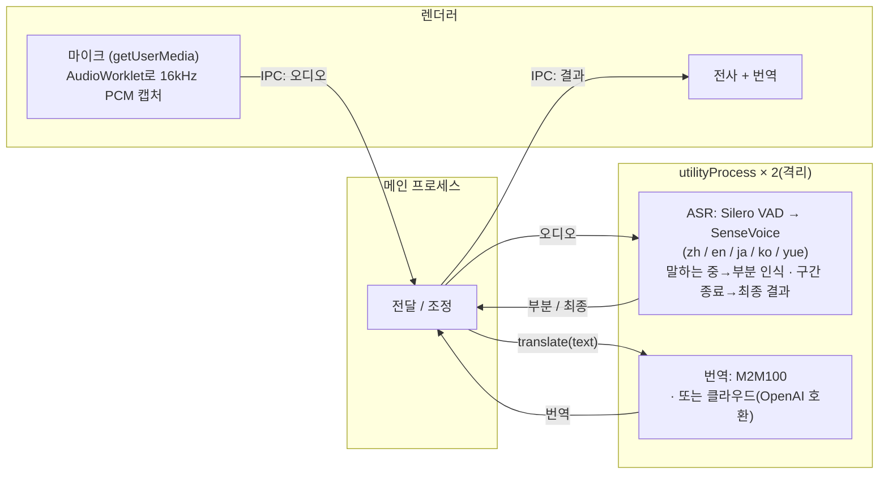

# Meeting Translator

> macOS용 로컬 실시간 회의 전사 & 번역 — 오디오와 텍스트가 기기를 벗어나지 않습니다.

[English](README.md) · [简体中文](README.zh-CN.md) · [日本語](README.ja.md) · **한국어**

## 기능

- 실시간 마이크 전사: 중국어 / 일본어 / 영어 / 한국어 / 광둥어 (자동 감지)
- 실시간 자막 — 말하는 동안 중간 결과 표시, 발화 구간 종료 시 확정
- **모국어 중심** — 첫 실행 시 모국어 선택(간체 / 번체 중국어, 일본어, 영어, 한국어); 전체 UI가 모국어로 표시되고, 번역을 켜면 회의 중 다른 언어가 모두 모국어로 번역
- 번역 엔진 전환 가능:
  - **로컬**(기본): M2M100을 기기에서 실행 — 최초 다운로드 후 오프라인 동작, 텍스트가 기기를 벗어나지 않음
  - **클라우드**(선택): OpenAI 호환 임의 엔드포인트(설정에서 Base URL / API Key / 모델 입력; 키는 기기에만 저장) — 활성화하면 텍스트가 제3자로 전송됨
- 대화 보관 — 세션을 저장하고 나중에 다시 열기
- 설정: 모국어, 자막 글자 크기, 번역 방식
- CPU만으로 실시간 동작(Apple Silicon 실측 RTF ≈ 0.03), GPU 불필요

## 사용법

1. **첫 실행** — 온보딩 화면에서 언어를 선택합니다.
2. **녹음 시작**을 클릭 — 말하면 자막이 실시간으로 표시됩니다.
3. **번역** 토글을 켜면 각 줄 아래에 모국어 번역이 표시됩니다.
4. **⚙ 설정**에서 모국어 · 글자 크기 · 번역 방식(및 클라우드 자격 증명)을 변경합니다.

마이크 접근을 요청하기 전에 앱이 먼저 용도를 설명합니다. 이후 macOS가 자체 권한 대화상자를 표시합니다.

## 개발

**electron-vite**(Vite + Vue 3 + Naive UI)로 구축. 메인 / preload / 렌더러 모두 TypeScript(`src/`).

```bash
npm install
npm run dev               # 개발(핫 리로드)
# 프로덕션 미리보기: npm run build && npm start
```

첫 실행 시 앱이 ASR 모델을 자동으로 다운로드합니다(설치 화면). 번역 모델은 최초 사용 시 다운로드됩니다.

기타 스크립트: `npm run build`, `npm run type-check`, `npm run clean`.

### 패키징(macOS)

```bash
npm run dist        # 빌드 + electron-builder → release/*.dmg (arm64)
npm run dist:dir    # 압축 해제된 .app만 (더 빠름, 디버깅용)
```

생성물은 현재 **서명되지 않음** — 열려면 우클릭 → 「열기」(또는 app에 `xattr -dr com.apple.quarantine` 실행). 공개 배포 시 Apple Developer ID로 서명 및 공증하세요. 모델은 동봉되지 않으며 최초 사용 시 사용자 데이터 폴더로 다운로드됩니다.

### 오프라인 테스트(GUI 불필요)

```bash
npm run test-pipeline -- test.wav   # 전사, 16kHz 모노 필요
# 변환: afconvert -f WAVE -d LEI16@16000 -c 1 in.wav out.wav

npm run test-translate              # 다방향 번역(최초 실행 시 모델 다운로드)
```

## 모델

| 모델 | 용도 | 크기 | 받기 |
|---|---|---|---|
| Silero VAD | 음성 구간 감지 | 629KB | 첫 실행 시 자동 다운로드 |
| SenseVoice (int8) | 다국어 음성 인식 | 약 230MB | 첫 실행 시 자동 다운로드 |
| M2M100-418M (int8) | 다국어 번역 | 약 630MB | 번역 최초 사용 시 자동 다운로드 |

번체 중국어는 M2M100 결과를 OpenCC로 변환해 생성합니다 — 모델 자체는 간체/번체를 구분하지 않습니다.

## 아키텍처



ASR과 번역은 각각 독립된 Electron `utilityProcess`에서 실행됩니다. 무거운 네이티브 추론이 UI를 막지 않고, 네이티브 크래시나 과도한 메모리 할당도 해당 프로세스에만 격리되어 앱 전체를 끌어내리지 않습니다.

전사는 [sherpa-onnx](https://github.com/k2-fsa/sherpa-onnx)(ONNX Runtime, 네이티브 N-API 모듈), 번역은 [Transformers.js](https://github.com/huggingface/transformers.js)로 Meta M2M100-418M(MIT)을 실행합니다(역시 onnxruntime 기반). 번역 기능은 `src/main/translation/`의 `Translator` 인터페이스 뒤에 있어(모델마다 spec 하나) — 더 강력한 로컬 모델이나 클라우드 API로 교체하려면 구현 하나만 추가하면 됩니다.

## 로드맵

- [ ] 더 높은 품질의 로컬 번역(Qwen2.5 등 LLM 백엔드)
- [ ] 회의록 내보내기(Markdown / SRT)
- [ ] 배포용 코드 서명 및 공증
