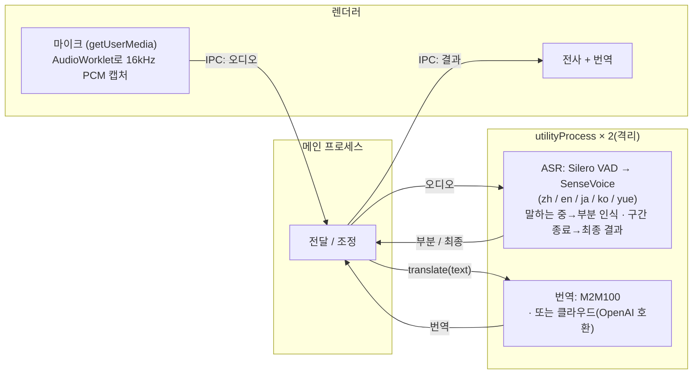

# Meeting Translator

> macOS · iOS · 브라우저용 로컬 실시간 회의 전사 & 번역 — 오디오와 텍스트가 기기에 머뭅니다(클라우드 번역은 선택).

[English](README.md) · [简体中文](README.zh-CN.md) · [日本語](README.ja.md) · **한국어**

지금 브라우저에서 사용해 보기: **https://baijunjie.github.io/meeting-translator/**

## 기능

- 실시간 마이크 전사: 중국어 / 일본어 / 영어 / 한국어 / 광둥어 (자동 감지)
- 실시간 자막 — 말하는 동안 중간 결과 표시, 발화 구간 종료 시 확정
- **모국어 중심** — 첫 실행 시 모국어 선택(간체 / 번체 중국어, 일본어, 영어, 한국어); 전체 UI가 모국어로 표시되고, 번역을 켜면 회의 중 다른 언어가 모두 모국어로 번역
- 번역 엔진 전환 가능:
  - **로컬**(기본): 기기에서 실행 — 최초 다운로드 후 오프라인 동작, 텍스트가 기기를 벗어나지 않음(macOS / 웹은 M2M100, iOS는 Apple Translation 프레임워크)
  - **클라우드**(선택): OpenAI 호환 임의 엔드포인트(설정에서 Base URL / API Key / 모델 입력; 키는 기기에만 저장) — 활성화하면 텍스트가 제3자로 전송됨
- 대화 보관 — 세션을 저장하고 나중에 다시 열기
- 설정: 모국어, 자막 글자 크기, 번역 방식
- CPU만으로 실시간 동작(Apple Silicon 실측 RTF ≈ 0.03), GPU 불필요

## 사용법

1. **첫 실행** — 온보딩 화면에서 언어를 선택합니다.
2. **녹음 시작**을 클릭 — 말하면 자막이 실시간으로 표시됩니다.
3. **번역** 토글을 켜면 각 줄 아래에 모국어 번역이 표시됩니다.
4. **⚙ 설정**에서 모국어 · 글자 크기 · 번역 방식(및 클라우드 자격 증명)을 변경합니다.

마이크 접근을 요청하기 전에 앱이 먼저 용도를 설명합니다. 이후 OS가 자체 권한 대화상자를 표시합니다.

## 프로젝트 구조

**pnpm 워크스페이스 monorepo** — 공유 로직/UI, 플랫폼별 1개 패키지. 세 플랫폼 모두 **동일한 `@mt/ui`**를 렌더링하며, 차이는 주입되는 `AppBridge`뿐입니다:

- `packages/core`(`@mt/core`) — 플랫폼 비의존 TS: 도메인 타입, 설정/보관 로직, 번역(`Translator` + 클라우드 + 간체/번체 변환), ASR 모델 목록, 플랫폼 능력 브리지 `AppBridge`.
- `packages/ui`(`@mt/ui`) — 공유 Vue 3 UI; 주입된 `AppBridge`를 통해서만 플랫폼에 접근(`window.api` 직접 참조 없음).
- `apps/macos`(`@mt/macos`) — Electron 앱; utilityProcess로 ASR/번역·녹음·fs 저장 등 `AppBridge`를 구현하고 `@mt/ui`를 호스팅.
- `apps/ios`(`@mt/ios`) — Capacitor 앱(동작 완비); 네이티브 플러그인이 기기에서 sherpa-onnx로 인식(iOS xcframework), 기기 내 번역은 Apple Translation 프레임워크(iOS 18+). `apps/ios/native-plugin/INTEGRATION.md` 참고.
- `apps/web`(`@mt/web`) — 설치 가능한 브라우저 **PWA**; ASR은 단일 스레드 WebAssembly를 Web Worker에서 실행(sherpa-onnx), 로컬 번역은 Transformers.js(M2M100)를 Web Worker에서 실행, 저장은 IndexedDB. 배포 주소 https://baijunjie.github.io/meeting-translator/ .
- `assets/` — 공유 브랜드 소스(`icon.svg` / `icon.png`); 각 앱이 여기서 자체 아이콘 포맷을 생성.

## 개발

**pnpm** 필요. Vite + Vue 3 + Naive UI, 전부 TypeScript(macOS는 electron-vite 사용).

```bash
pnpm install
pnpm dev                    # macOS 앱을 핫 리로드로 실행(→ @mt/macos)
pnpm --filter @mt/web dev   # 브라우저 PWA 개발 서버 실행(→ @mt/web)
```

iOS는 `apps/ios/native-plugin/INTEGRATION.md`를 참고하세요(네이티브 플러그인을 Capacitor iOS 호스트에 연결해야 하며, Xcode 툴체인이 필요하고 Translation 프레임워크는 실기기가 필요).

macOS / 웹은 첫 실행 시 앱이 ASR 모델을 자동으로 다운로드합니다(설치 화면). 로컬 번역 모델은 최초 사용 시 다운로드됩니다.

기타 스크립트: `pnpm build`, `pnpm type-check`. 패키지 단위: `pnpm --filter @mt/macos <script>`(예: `clean`, `test-translate`).

### 패키징(macOS)

```bash
pnpm dist        # 빌드 + electron-builder → apps/macos/release/*.dmg (arm64)
pnpm dist:dir    # 압축 해제된 .app만 (더 빠름, 디버깅용)
```

생성물은 현재 **서명되지 않음** — 열려면 우클릭 → 「열기」(또는 app에 `xattr -dr com.apple.quarantine` 실행). 공개 배포 시 Apple Developer ID로 서명 및 공증하세요. 모델은 동봉되지 않으며 최초 사용 시 사용자 데이터 폴더로 다운로드됩니다.

### 웹(PWA)

배포 주소 **https://baijunjie.github.io/meeting-translator/** — 설치 가능하며, 첫 로드 이후 오프라인으로 동작합니다(모델과 앱 셸을 캐시).

- ASR은 **단일 스레드 WebAssembly**를 Web Worker에서 실행(sherpa-onnx) — COOP/COEP 헤더가 필요 없어 GitHub Pages에서 무료로 호스팅할 수 있습니다.
- 모델은 최초 사용 시 CDN에서 가져오며(SenseVoice는 HuggingFace; Silero VAD는 GitHub Releases에 CORS가 없어 앱과 동일 출처로 번들), Cache Storage에 캐시됩니다. 설정/보관은 IndexedDB에 저장됩니다.
- GitHub Actions 워크플로(`.github/workflows/deploy-web.yml`)가 `main`에 푸시할 때마다 배포합니다.

```bash
pnpm --filter @mt/web dev      # 개발 서버
pnpm --filter @mt/web build    # 프로덕션 빌드 → apps/web/dist
```

### 오프라인 테스트(GUI 불필요)

```bash
npm run test-pipeline -- test.wav   # 전사, 16kHz 모노 필요
# 변환: afconvert -f WAVE -d LEI16@16000 -c 1 in.wav out.wav

npm run test-translate              # 다방향 번역(최초 실행 시 모델 다운로드)
```

## 모델

동일한 ASR 모델(Silero VAD + SenseVoice int8)이 모든 플랫폼에서 동작하며, 런타임만 다릅니다(macOS는 네이티브 N-API, iOS는 xcframework, 웹은 단일 스레드 WASM). 최초 실행 시 `@mt/core` 목록에서 다운로드합니다.

| 모델 | 용도 | 크기 | 받기 |
|---|---|---|---|
| Silero VAD | 음성 구간 감지 | 629KB | 첫 실행 시 자동 다운로드 |
| SenseVoice (int8) | 다국어 음성 인식 | 약 230MB | 첫 실행 시 자동 다운로드 |
| M2M100-418M (int8) | 다국어 번역 | 약 630MB | 번역 최초 사용 시 자동 다운로드(macOS / 웹) |

iOS는 M2M100을 **다운로드하지 않고** Apple의 기기 내 번역을 사용합니다. 번체 중국어는 스크립트 변환으로 생성합니다 — M2M100 / Apple 모두 간체/번체를 구분하지 않습니다.

## 아키텍처

세 플랫폼은 `@mt/core` + `@mt/ui`를 공유하며 차이는 `AppBridge` 구현뿐입니다. 동일한 ASR 모델이 각 플랫폼의 런타임에서 동작합니다 — **macOS** = sherpa-onnx-node(네이티브 N-API), **iOS** = sherpa-onnx xcframework(네이티브 C++), **웹** = sherpa-onnx 단일 스레드 WASM. 로컬 번역도 플랫폼별로 — **macOS / 웹** = M2M100(Transformers.js, onnxruntime-node / onnxruntime-web), **iOS** = Apple Translation 프레임워크. 클라우드(OpenAI 호환 임의 엔드포인트)는 세 플랫폼 모두에서 사용 가능합니다.

아래 그림은 macOS의 프로세스 구성입니다(iOS와 웹은 다르며, 각각 네이티브 플러그인 / WASM Worker로, Electron 프로세스가 아닙니다):



macOS에서는 ASR과 번역이 각각 독립된 Electron `utilityProcess`에서 실행됩니다. 무거운 네이티브 추론이 UI를 막지 않고, 네이티브 크래시나 과도한 메모리 할당도 해당 프로세스에만 격리되어 앱 전체를 끌어내리지 않습니다. 웹에서 대응하는 격리는 작업별 Web Worker이고, iOS에서는 네이티브 플러그인이 담당합니다.

전사는 [sherpa-onnx](https://github.com/k2-fsa/sherpa-onnx)(ONNX Runtime), macOS와 웹의 로컬 번역은 [Transformers.js](https://github.com/huggingface/transformers.js)로 Meta M2M100-418M(MIT)을 실행합니다. 번역은 `@mt/core`의 `Translator` 인터페이스 뒤에 있고(모델마다 spec 하나) — 더 강력한 로컬 모델, Apple 프레임워크, 클라우드 API로 교체하려면 구현 하나만 추가하면 됩니다.
