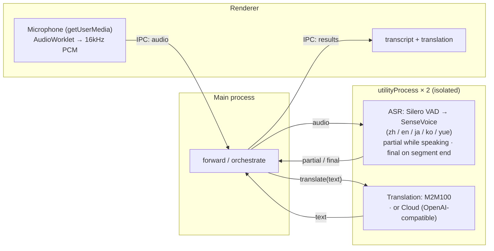

# Meeting Translator

> Local, real-time meeting transcription & translation for macOS — audio and text never leave your machine.

**English** · [简体中文](README.zh-CN.md) · [日本語](README.ja.md) · [한국어](README.ko.md)

## Features

- Real-time microphone transcription: Chinese / Japanese / English / Korean / Cantonese (auto-detected)
- Live captions — partial results appear while you speak, finalized when the segment ends
- **Native-language driven** — pick your language on first launch (Simplified / Traditional Chinese, Japanese, English, Korean); the whole UI is shown in it, and when translation is on, everything spoken in other languages is translated into it
- Switchable translation engine:
  - **Local** (default): M2M100 runs on-device — downloaded once, then works offline; text never leaves your machine
  - **Cloud** (optional): any OpenAI-compatible endpoint (set Base URL / API Key / Model in Settings; the key is stored only on your device) — enabling it means text is sent to a third party
- Archive conversations — save a session and reopen it later
- Settings: native language, transcript font size, translation engine
- Runs in real time on CPU (RTF ≈ 0.03 on Apple Silicon), no GPU required

## Usage

1. **First launch** — choose your language on the onboarding screen.
2. Click **Start Recording** — captions appear live as you speak.
3. Toggle **Translate** to show a translation into your language under each line.
4. Open **Settings** (⚙) to change language, font size, or translation engine (and cloud credentials).

Before requesting the microphone, the app first explains what it's used for; macOS then shows its own permission prompt.

## Project structure

A **pnpm-workspace monorepo** — shared logic/UI, one package per platform:

- `packages/core` (`@mt/core`) — platform-agnostic TypeScript: domain types, settings/archive logic, translation (`Translator` + cloud + Simplified/Traditional conversion), the ASR model registry, and the platform-capability bridge interface (`AppBridge`).
- `packages/ui` (`@mt/ui`) — shared Vue 3 UI; reaches the platform only through an injected `AppBridge` (no `window.api`).
- `apps/macos` (`@mt/macos`) — the Electron app; implements `AppBridge` (audio capture, ASR + translation in utilityProcess workers, fs storage) and hosts `@mt/ui`.
- `apps/ios` (`@mt/ios`) — a Capacitor app (scaffold) hosting the same `@mt/ui` in a WebView, with a native ASR plugin — see `apps/ios/native-plugin/INTEGRATION.md`.
- `assets/` — shared brand source (`icon.svg` / `icon.png`); each app generates its own icon format from it.

## Development

Requires **pnpm**. Built with **electron-vite** (Vite + Vue 3 + Naive UI), all TypeScript.

```bash
pnpm install
pnpm dev               # run the macOS app with hot reload (→ @mt/macos)
```

On first launch the app downloads the ASR models itself (a setup screen); translation downloads on first use.

Other scripts: `pnpm build`, `pnpm type-check`. Per-package: `pnpm --filter @mt/macos <script>` (e.g. `clean`, `test-translate`).

### Packaging (macOS)

```bash
pnpm dist        # build + electron-builder → apps/macos/release/*.dmg (arm64)
pnpm dist:dir    # unpacked .app only (faster, for debugging)
```

The packaged app is currently **unsigned** — to open it, right-click → Open (or run `xattr -dr com.apple.quarantine` on the app). For public distribution, sign & notarize with an Apple Developer ID. Models are not bundled; they download to the user's app-data folder on first use.

### Offline testing (no GUI)

```bash
npm run test-pipeline -- test.wav   # transcription, needs 16kHz mono
# convert: afconvert -f WAVE -d LEI16@16000 -c 1 in.wav out.wav

npm run test-translate              # multi-direction translation (downloads model on first run)
```

## Models

| Model | Purpose | Size | How |
|---|---|---|---|
| Silero VAD | voice activity detection | 629KB | auto-downloaded on first launch |
| SenseVoice (int8) | multilingual ASR | ~230MB | auto-downloaded on first launch |
| M2M100-418M (int8) | multilingual translation | ~630MB | auto-downloaded on first use of translation |

Traditional Chinese output is produced by converting M2M100's result with OpenCC — the model itself doesn't distinguish scripts.

## Architecture



ASR and translation each run in their own Electron `utilityProcess`, so heavy native inference never blocks the UI — and a native crash (or oversized allocation) is isolated to that process instead of taking down the app.

The same `@mt/ui` runs on iOS in a Capacitor WebView; only the `AppBridge` implementation differs (native ASR plugin + cloud translation).

Transcription uses [sherpa-onnx](https://github.com/k2-fsa/sherpa-onnx) (ONNX Runtime, native N-API module); translation uses [Transformers.js](https://github.com/huggingface/transformers.js) running Meta M2M100-418M (MIT), also on onnxruntime. Translation sits behind the `Translator` interface in `@mt/core` (one spec per model), with the local engine implemented in `apps/macos` — swapping in another local model or a cloud API is just another implementation.

## Roadmap

- [ ] Higher-quality local translation (e.g. an LLM backend like Qwen2.5)
- [ ] Export transcripts (Markdown / SRT)
- [ ] Code signing & notarization for distribution
