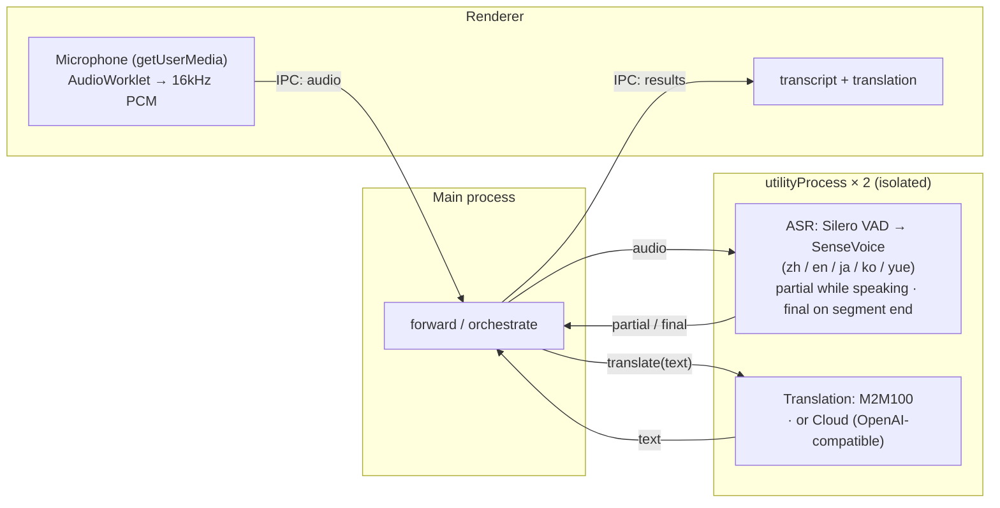

# Meeting Translator

> Local, real-time meeting transcription & translation for macOS, iOS, and the browser — audio and text stay on-device (cloud translation optional).

**English** · [简体中文](README.zh-CN.md) · [日本語](README.ja.md) · [한국어](README.ko.md)

Try it now in your browser: **https://baijunjie.github.io/meeting-translator/**

## Features

- Real-time microphone transcription: Chinese / Japanese / English / Korean / Cantonese (auto-detected)
- Live captions — partial results appear while you speak, finalized when the segment ends
- **Native-language driven** — pick your language on first launch (Simplified / Traditional Chinese, Japanese, English, Korean); the whole UI is shown in it, and when translation is on, everything spoken in other languages is translated into it
- Switchable translation engine:
  - **Local** (default): on-device translation — downloaded once, then works offline; text never leaves your machine (macOS / web run M2M100; iOS uses Apple's Translation framework)
  - **Cloud** (optional): any OpenAI-compatible endpoint (set Base URL / API Key / Model in Settings; the key is stored only on your device) — enabling it means text is sent to a third party
- Archive conversations — save a session and reopen it later
- Settings: native language, transcript font size, translation engine
- Runs in real time on CPU (RTF ≈ 0.03 on Apple Silicon), no GPU required

## Usage

1. **First launch** — choose your language on the onboarding screen.
2. Click **Start Recording** — captions appear live as you speak.
3. Toggle **Translate** to show a translation into your language under each line.
4. Open **Settings** (⚙) to change language, font size, or translation engine (and cloud credentials).

Before requesting the microphone, the app first explains what it's used for; the OS then shows its own permission prompt.

## Project structure

A **pnpm-workspace monorepo** — shared logic/UI, one package per platform. All three platforms render the **same `@mt/ui`** and differ only in the injected `AppBridge`:

- `packages/core` (`@mt/core`) — platform-agnostic TypeScript: domain types, settings/archive logic, translation (`Translator` + cloud + Simplified/Traditional conversion), the ASR model registry, and the platform-capability bridge interface (`AppBridge`).
- `packages/ui` (`@mt/ui`) — shared Vue 3 UI; reaches the platform only through an injected `AppBridge` (no `window.api`).
- `apps/macos` (`@mt/macos`) — the Electron app; implements `AppBridge` (audio capture, ASR + translation each in their own utilityProcess worker, fs storage) and hosts `@mt/ui`.
- `apps/ios` (`@mt/ios`) — a Capacitor app, fully functional: a native plugin runs sherpa-onnx on device for ASR (via the iOS xcframework), and on-device translation uses Apple's Translation framework (iOS 18+). See `apps/ios/native-plugin/INTEGRATION.md`.
- `apps/web` (`@mt/web`) — an installable browser **PWA**; runs sherpa-onnx as single-threaded WebAssembly in a Web Worker for ASR, and M2M100 via Transformers.js in a Web Worker for local translation. Storage via IndexedDB. Live at https://baijunjie.github.io/meeting-translator/.
- `assets/` — shared brand source (`icon.svg` / `icon.png`); each app generates its own icon format from it.

## Development

Requires **pnpm**. Vite + Vue 3 + Naive UI, all TypeScript (macOS uses electron-vite).

```bash
pnpm install
pnpm dev                    # run the macOS app with hot reload (→ @mt/macos)
pnpm --filter @mt/web dev   # run the browser PWA dev server (→ @mt/web)
```

For iOS, see `apps/ios/native-plugin/INTEGRATION.md` (the native plugin must be wired into a Capacitor iOS host; it needs the Xcode toolchain and a real device for the Translation framework).

On macOS/web, the app downloads the ASR models itself on first launch (a setup screen); local translation downloads on first use (web) / first use (macOS).

Other scripts: `pnpm build`, `pnpm type-check`. Per-package: `pnpm --filter @mt/macos <script>` (e.g. `clean`, `test-translate`).

### Packaging (macOS)

```bash
pnpm dist        # build + electron-builder → apps/macos/release/*.dmg (arm64)
pnpm dist:dir    # unpacked .app only (faster, for debugging)
```

The packaged app is currently **unsigned** — to open it, right-click → Open (or run `xattr -dr com.apple.quarantine` on the app). For public distribution, sign & notarize with an Apple Developer ID. Models are not bundled; they download to the user's app-data folder on first use.

### Web (PWA)

Live at **https://baijunjie.github.io/meeting-translator/** — installable, and works offline after the first load (models and app shell are cached).

- ASR runs sherpa-onnx as **single-threaded WebAssembly** in a Web Worker — no COOP/COEP headers needed, so it can be hosted for free on GitHub Pages.
- Models are fetched from CDN on first use (SenseVoice from HuggingFace; Silero VAD is bundled same-origin because GitHub Releases lacks CORS) and cached in Cache Storage; settings/archives live in IndexedDB.
- Deployed by a GitHub Actions workflow (`.github/workflows/deploy-web.yml`) on every push to `main`.

```bash
pnpm --filter @mt/web dev      # dev server
pnpm --filter @mt/web build    # production build → apps/web/dist
```

### Offline testing (no GUI)

```bash
npm run test-pipeline -- test.wav   # transcription, needs 16kHz mono
# convert: afconvert -f WAVE -d LEI16@16000 -c 1 in.wav out.wav

npm run test-translate              # multi-direction translation (downloads model on first run)
```

## Models

The same ASR models (Silero VAD + SenseVoice int8) run on every platform; only the runtime differs (native N-API on macOS, the iOS xcframework, single-threaded WASM on web). They download on first run from the `@mt/core` registry.

| Model | Purpose | Size | How |
|---|---|---|---|
| Silero VAD | voice activity detection | 629KB | auto-downloaded on first launch |
| SenseVoice (int8) | multilingual ASR | ~230MB | auto-downloaded on first launch |
| M2M100-418M (int8) | multilingual translation | ~630MB | auto-downloaded on first use of translation (macOS / web) |

iOS does **not** download M2M100 — it uses Apple's on-device translation instead. Traditional Chinese output is produced by script conversion (M2M100 / Apple don't distinguish scripts).

## Architecture

All three platforms share `@mt/core` + `@mt/ui` and differ only in the `AppBridge` implementation. The same ASR models run everywhere, on a per-platform runtime — **macOS** = sherpa-onnx-node (native N-API), **iOS** = sherpa-onnx xcframework (native C++), **web** = sherpa-onnx single-threaded WASM. Local translation is also per-platform — **macOS / web** = M2M100 via Transformers.js (onnxruntime-node / onnxruntime-web), **iOS** = Apple's Translation framework. Cloud (any OpenAI-compatible endpoint) is available on all three.

The macOS process layout (iOS and web differ — native plugin / WASM workers respectively, not Electron processes):



On macOS, ASR and translation each run in their own Electron `utilityProcess`, so heavy native inference never blocks the UI — and a native crash (or oversized allocation) is isolated to that process instead of taking down the app. On web the equivalent isolation is a Web Worker per task; on iOS the work happens in the native plugin.

Transcription uses [sherpa-onnx](https://github.com/k2-fsa/sherpa-onnx) (ONNX Runtime); local translation uses [Transformers.js](https://github.com/huggingface/transformers.js) running Meta M2M100-418M (MIT) on macOS and web. Translation sits behind the `Translator` interface in `@mt/core` (one spec per model) — swapping in another local model, Apple's framework, or a cloud API is just another implementation.
