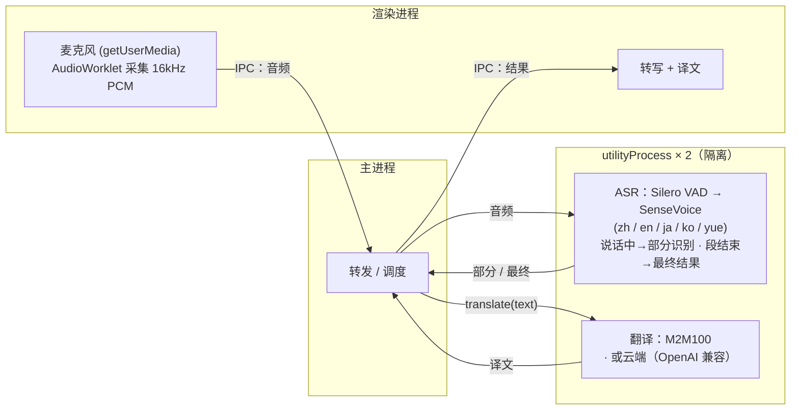

# Meeting Translator

> macOS 本地实时会议转写与翻译——音频和文本都不离开你的电脑。

[English](README.md) · **简体中文** · [日本語](README.ja.md) · [한국어](README.ko.md)

## 功能

- 实时麦克风转写：中文 / 日语 / 英语 / 韩语 / 粤语（自动检测）
- 实时字幕——说话过程中即显示部分结果，语音段结束后定稿
- **母语驱动**——首次启动选择母语（简体 / 繁體中文、日语、英语、韩语）；整个界面用母语呈现，开启翻译后会议中其他语言统一翻成母语
- 翻译引擎可切换：
  - **本地**（默认）：M2M100 在本机运行——首次下载后离线可用，文本不出机器
  - **云端**（可选）：任意 OpenAI 兼容端点（在设置里填 Base URL / API Key / 模型，密钥仅存本机）——启用即表示文本会发往第三方
- 对话归档——保存一次会话，之后可重新查看
- 设置页：母语、转写字体大小、翻译方式
- 纯 CPU 实时运行（Apple Silicon 实测 RTF ≈ 0.03），无需 GPU

## 使用

1. **首次启动**——在引导页选择你的语言。
2. 点击**开始录音**——字幕随说话实时出现。
3. 打开**翻译**开关——每行下方显示母语译文。
4. 点 **⚙ 设置**——可改母语、字体大小、翻译方式（及云端凭证）。

请求麦克风前，应用会先说明用途；随后 macOS 才弹出系统授权提示。

## 项目结构

**pnpm workspace monorepo**——共享逻辑/UI，每个平台一个包：

- `packages/core`（`@mt/core`）——平台无关 TS：领域类型、设置/归档逻辑、翻译（`Translator` + 云端 + 简繁转换）、ASR 模型清单、平台能力桥接接口 `AppBridge`。
- `packages/ui`（`@mt/ui`）——共享 Vue 3 界面；仅通过注入的 `AppBridge` 触达平台（不直接用 `window.api`）。
- `apps/macos`（`@mt/macos`）——Electron 应用；以 utilityProcess 子进程实现 ASR/翻译、采音、fs 存储等 `AppBridge`，并承载 `@mt/ui`。
- `apps/ios`（`@mt/ios`）——Capacitor 应用（骨架），WebView 承载同一套 `@mt/ui`，识别由原生插件实现——见 `apps/ios/native-plugin/INTEGRATION.md`。
- `assets/`——共享品牌源（`icon.svg` / `icon.png`），各平台由它生成自己的图标格式。

## 开发

需要 **pnpm**。基于 **electron-vite**（Vite + Vue 3 + Naive UI），全 TypeScript。

```bash
pnpm install
pnpm dev               # 跑 macOS 应用（热更新，→ @mt/macos）
```

首次启动时应用会自行下载 ASR 模型（有下载页）；翻译模型在首次使用时下载。

其他脚本：`pnpm build`、`pnpm type-check`。单包：`pnpm --filter @mt/macos <script>`（如 `clean`、`test-translate`）。

### 打包（macOS）

```bash
pnpm dist        # 构建 + electron-builder → apps/macos/release/*.dmg（arm64）
pnpm dist:dir    # 仅生成未压缩 .app（更快，调试用）
```

打包产物当前**未签名**——打开需右键 →「打开」（或对 app 执行 `xattr -dr com.apple.quarantine`）。正式公开发布请用 Apple Developer ID 签名并公证。模型不随包分发，首次使用时下载到用户数据目录。

### 离线测试（无需 GUI）

```bash
npm run test-pipeline -- test.wav   # 转写，需 16kHz 单声道
# 转换: afconvert -f WAVE -d LEI16@16000 -c 1 in.wav out.wav

npm run test-translate              # 多向翻译（首次会下载模型）
```

## 模型

| 模型 | 用途 | 大小 | 获取 |
|---|---|---|---|
| Silero VAD | 语音活动检测 | 629KB | 首次启动自动下载 |
| SenseVoice (int8) | 多语言语音识别 | 约 230MB | 首次启动自动下载 |
| M2M100-418M (int8) | 多语言翻译 | 约 630MB | 首次使用翻译时自动下载 |

繁體中文是把 M2M100 的结果用 OpenCC 转换得到的——模型本身不区分简/繁。

## 技术架构



ASR 与翻译各自跑在独立的 Electron `utilityProcess`：重推理不阻塞 UI，原生崩溃或超大内存分配也只影响该子进程，不会拖垮整个应用。

同一套 `@mt/ui` 也在 iOS 的 Capacitor WebView 中运行，差别仅在 `AppBridge` 的实现（原生识别插件 + 云端翻译）。

转写引擎为 [sherpa-onnx](https://github.com/k2-fsa/sherpa-onnx)（ONNX Runtime，原生 N-API 模块）；翻译用 [Transformers.js](https://github.com/huggingface/transformers.js) 跑 Meta M2M100-418M（MIT），同样基于 onnxruntime。翻译封装在 `@mt/core` 的 `Translator` 接口之后（每个模型一份 spec），本地引擎实现在 `apps/macos`——换更强的本地模型或接云 API，只是新增一个实现。

## Roadmap

- [ ] 更高质量本地翻译（如 Qwen2.5 等 LLM 后端）
- [ ] 会议记录导出（Markdown / SRT）
- [ ] 发布用的代码签名与公证
