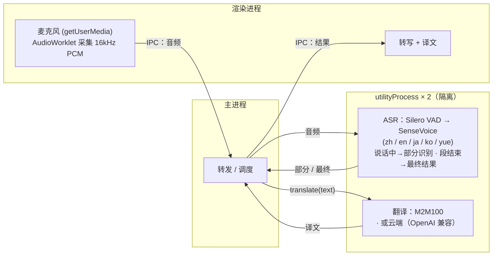

# Meeting Translator

> 本地实时会议转写与翻译，支持 macOS、iOS 与浏览器——音频和文本都留在本机（云端翻译为可选项）。

[English](README.md) · **简体中文** · [日本語](README.ja.md) · [한국어](README.ko.md)

立即在浏览器里试用：**https://baijunjie.github.io/meeting-translator/**

## 功能

- 实时麦克风转写：中文 / 日语 / 英语 / 韩语 / 粤语（自动检测）
- 实时字幕——说话过程中即显示部分结果，语音段结束后定稿
- **母语驱动**——首次启动选择母语（简体 / 繁體中文、日语、英语、韩语）；整个界面用母语呈现，开启翻译后会议中其他语言统一翻成母语
- 翻译引擎可切换：
  - **本地**（默认）：在本机运行——首次下载后离线可用，文本不出机器（macOS / 网页用 M2M100，iOS 用 Apple 的 Translation 框架）
  - **云端**（可选）：任意 OpenAI 兼容端点（在设置里填 Base URL / API Key / 模型，密钥仅存本机）——启用即表示文本会发往第三方
- 对话归档——保存一次会话，之后可重新查看
- 设置页：母语、转写字体大小、翻译方式
- 纯 CPU 实时运行（Apple Silicon 实测 RTF ≈ 0.03），无需 GPU

## 使用

1. **首次启动**——在引导页选择你的语言。
2. 点击**开始录音**——字幕随说话实时出现。
3. 打开**翻译**开关——每行下方显示母语译文。
4. 点 **⚙ 设置**——可改母语、字体大小、翻译方式（及云端凭证）。

请求麦克风前，应用会先说明用途；随后系统才弹出授权提示。

## 项目结构

**pnpm workspace monorepo**——共享逻辑/UI，每个平台一个包。三个平台都渲染**同一套 `@mt/ui`**，差别只在注入的 `AppBridge`：

- `packages/core`（`@mt/core`）——平台无关 TS：领域类型、设置/归档逻辑、翻译（`Translator` + 云端 + 简繁转换）、ASR 模型清单、平台能力桥接接口 `AppBridge`。
- `packages/ui`（`@mt/ui`）——共享 Vue 3 界面；仅通过注入的 `AppBridge` 触达平台（不直接用 `window.api`）。
- `apps/macos`（`@mt/macos`）——Electron 应用；以 utilityProcess 子进程实现 ASR/翻译、采音、fs 存储等 `AppBridge`，并承载 `@mt/ui`。
- `apps/ios`（`@mt/ios`）——Capacitor 应用，已可用：原生插件在设备端跑 sherpa-onnx 做识别（iOS xcframework），端上翻译用 Apple 的 Translation 框架（iOS 18+）。详见 `apps/ios/native-plugin/INTEGRATION.md`。
- `apps/web`（`@mt/web`）——可安装的浏览器 **PWA**；ASR 用单线程 WebAssembly 在 Web Worker 里跑 sherpa-onnx，本地翻译用 Transformers.js（M2M100）在 Web Worker 里跑，存储用 IndexedDB。线上地址 https://baijunjie.github.io/meeting-translator/ 。
- `assets/`——共享品牌源（`icon.svg` / `icon.png`），各平台由它生成自己的图标格式。

## 开发

需要 **pnpm**。Vite + Vue 3 + Naive UI，全 TypeScript（macOS 用 electron-vite）。

```bash
pnpm install
pnpm dev                    # 跑 macOS 应用（热更新，→ @mt/macos）
pnpm --filter @mt/web dev   # 跑浏览器 PWA 开发服务器（→ @mt/web）
```

iOS 见 `apps/ios/native-plugin/INTEGRATION.md`（需把原生插件接入 Capacitor iOS 壳，依赖 Xcode 工具链，Translation 框架还需真机）。

macOS / 网页首次启动时应用会自行下载 ASR 模型（有下载页）；本地翻译模型在首次使用时下载。

其他脚本：`pnpm build`、`pnpm type-check`。单包：`pnpm --filter @mt/macos <script>`（如 `clean`、`test-translate`）。

### 打包（macOS）

```bash
pnpm dist        # 构建 + electron-builder → apps/macos/release/*.dmg（arm64）
pnpm dist:dir    # 仅生成未压缩 .app（更快，调试用）
```

打包产物当前**未签名**——打开需右键 →「打开」（或对 app 执行 `xattr -dr com.apple.quarantine`）。正式公开发布请用 Apple Developer ID 签名并公证。模型不随包分发，首次使用时下载到用户数据目录。

### 网页（PWA）

线上地址 **https://baijunjie.github.io/meeting-translator/** ——可安装，首次加载后离线可用（模型与应用外壳都会缓存）。

- ASR 用**单线程 WebAssembly** 在 Web Worker 里跑 sherpa-onnx——无需 COOP/COEP 头，因此能免费托管在 GitHub Pages。
- 模型首次使用时从 CDN 拉取（SenseVoice 走 HuggingFace；Silero VAD 因 GitHub Releases 无 CORS 而随应用同源打包），缓存进 Cache Storage；设置/归档存在 IndexedDB。
- 由 GitHub Actions 工作流（`.github/workflows/deploy-web.yml`）在每次推送到 `main` 时部署。

```bash
pnpm --filter @mt/web dev      # 开发服务器
pnpm --filter @mt/web build    # 生产构建 → apps/web/dist
```

### 离线测试（无需 GUI）

```bash
npm run test-pipeline -- test.wav   # 转写，需 16kHz 单声道
# 转换: afconvert -f WAVE -d LEI16@16000 -c 1 in.wav out.wav

npm run test-translate              # 多向翻译（首次会下载模型）
```

## 模型

同一套 ASR 模型（Silero VAD + SenseVoice int8）在所有平台运行，只是运行时不同（macOS 原生 N-API、iOS xcframework、网页单线程 WASM），首次运行时按 `@mt/core` 清单下载。

| 模型 | 用途 | 大小 | 获取 |
|---|---|---|---|
| Silero VAD | 语音活动检测 | 629KB | 首次启动自动下载 |
| SenseVoice (int8) | 多语言语音识别 | 约 230MB | 首次启动自动下载 |
| M2M100-418M (int8) | 多语言翻译 | 约 630MB | 首次使用翻译时自动下载（macOS / 网页） |

iOS **不**下载 M2M100，改用 Apple 的端上翻译。繁體中文是把结果做脚本转换得到的——M2M100 / Apple 都不区分简/繁。

## 技术架构

三个平台共享 `@mt/core` + `@mt/ui`，差别只在 `AppBridge` 实现。同一套 ASR 模型在各端按各自运行时跑——**macOS** = sherpa-onnx-node（原生 N-API），**iOS** = sherpa-onnx xcframework（原生 C++），**网页** = sherpa-onnx 单线程 WASM。本地翻译也按平台分——**macOS / 网页** = M2M100（Transformers.js，onnxruntime-node / onnxruntime-web），**iOS** = Apple Translation 框架。云端（任意 OpenAI 兼容端点）三端都可用。

下图是 macOS 的进程划分（iOS 与网页不同——分别是原生插件 / WASM Worker，不是 Electron 进程）：



在 macOS 上，ASR 与翻译各自跑在独立的 Electron `utilityProcess`：重推理不阻塞 UI，原生崩溃或超大内存分配也只影响该子进程，不会拖垮整个应用。网页上对应的隔离是每个任务一个 Web Worker；iOS 上则由原生插件承担。

转写引擎为 [sherpa-onnx](https://github.com/k2-fsa/sherpa-onnx)（ONNX Runtime）；macOS 与网页的本地翻译用 [Transformers.js](https://github.com/huggingface/transformers.js) 跑 Meta M2M100-418M（MIT）。翻译封装在 `@mt/core` 的 `Translator` 接口之后（每个模型一份 spec）——换更强的本地模型、Apple 框架或云 API，只是新增一个实现。
